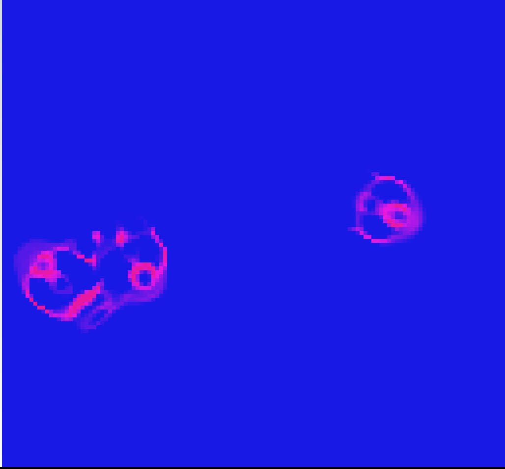

# lenia-js

[Lenia](https://github.com/Chakazul/Lenia) implementation with TypeScript and React.

## pages 

- with canvas API
  - https://hirokiyoshida837.github.io/Lenia-js/lenia/canvas
- with p5.js
  - https://hirokiyoshida837.github.io/Lenia-js/lenia/p5

## refs

- https://github.com/yosupo06/library-checker-problems/issues/746
- 
